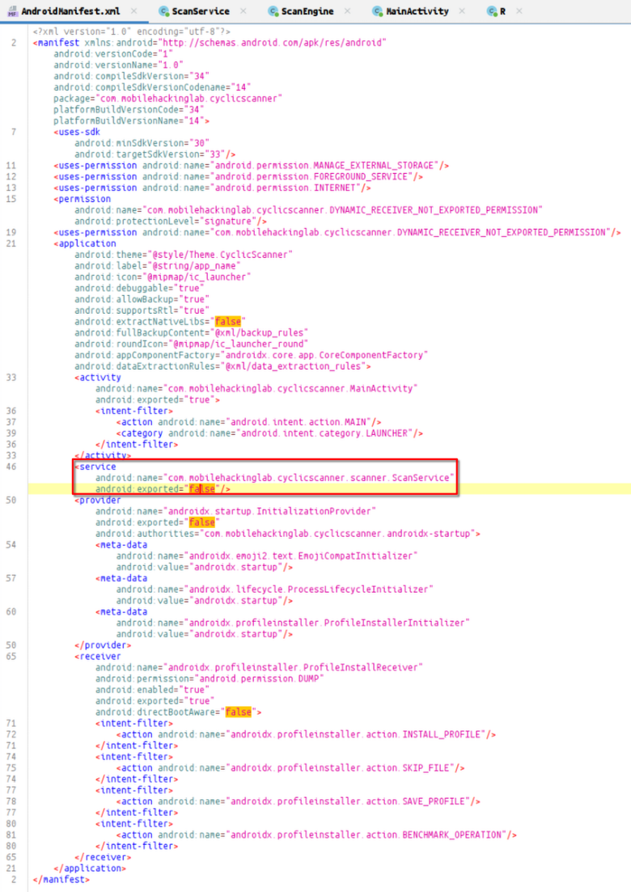
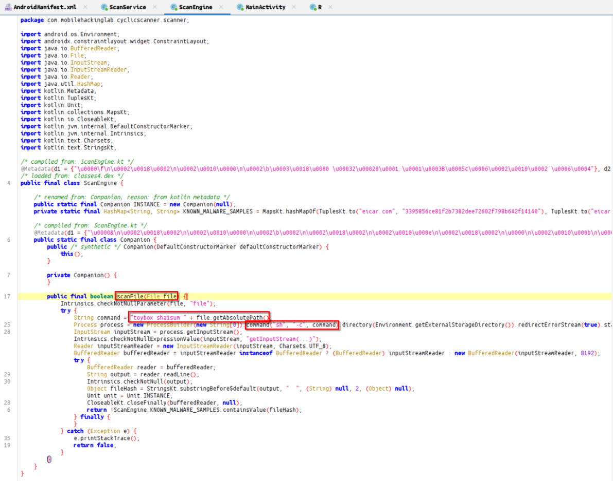
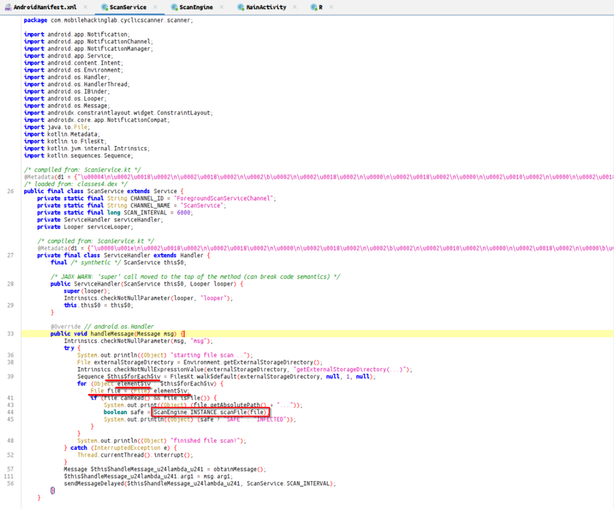
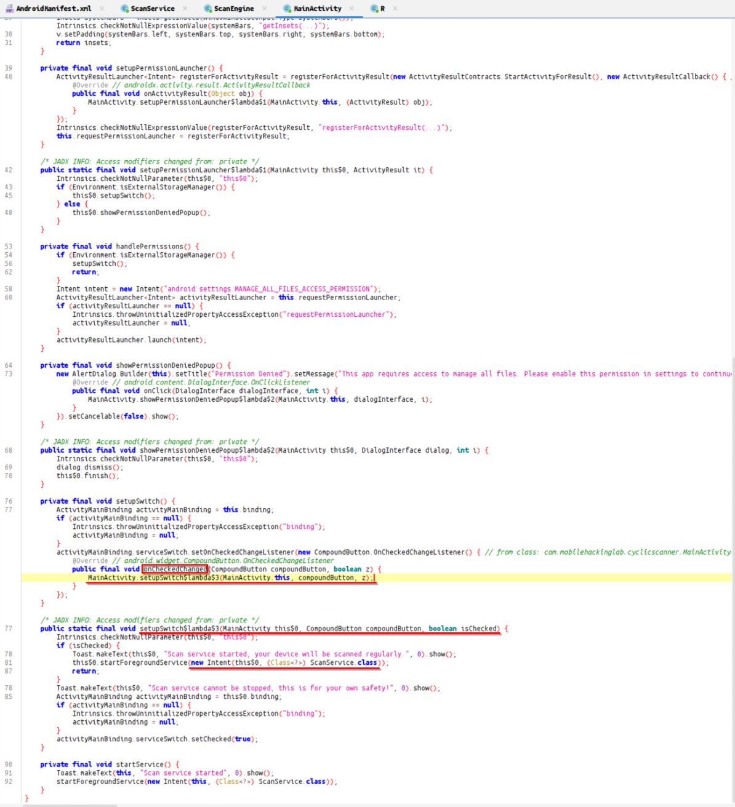
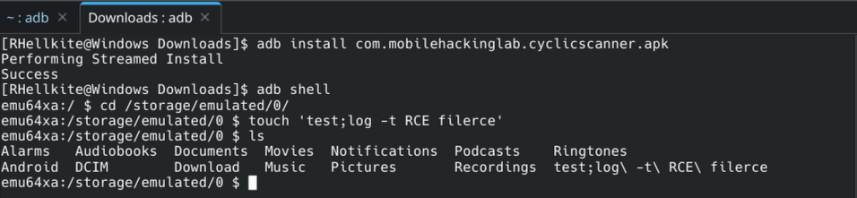
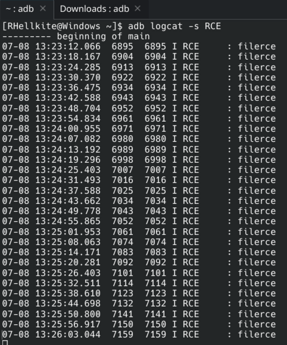

While examining the manifest, I found a service, but it was not exported.

In the code itself, a scanFile function was discovered containing a command injection vulnerability.

The call to this function was located inside the handleMessage function, which also calls itself recursively through messages.

The first (initial) message is triggered by changing the state of a toggle button.

To exploit this, we create a file.

And then activate the scanner.

From the log output, it is evident that the payload was executed.

