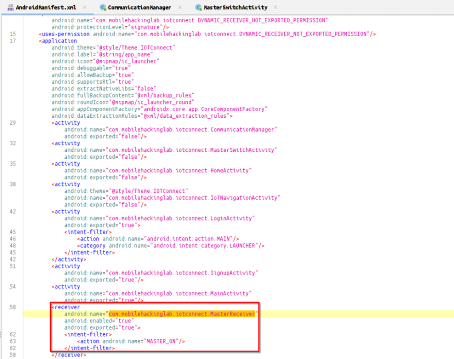
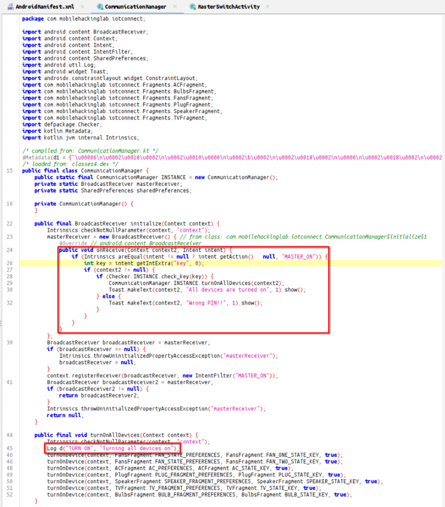
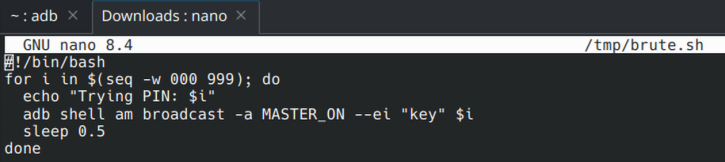
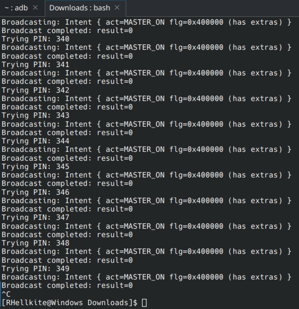
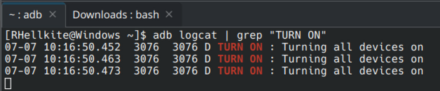
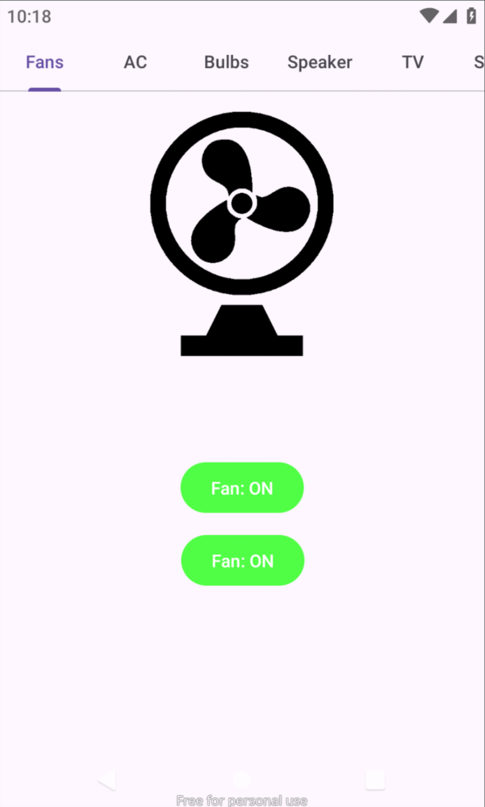

In the application manifest, a receiver was found with the flag exported="true" and an intent-filter with the action MASTER_ON.

Upon further investigation, it was revealed that an additional field key is required, containing a 3-digit PIN code. If the correct PIN is provided, a log entry confirms the match.

We write a script to brute-force the PIN code, as there are no restrictions on the number of attempts.

Brute-forcing in progress.

Log output upon successful PIN match.

Program interface after enabling all devices.

