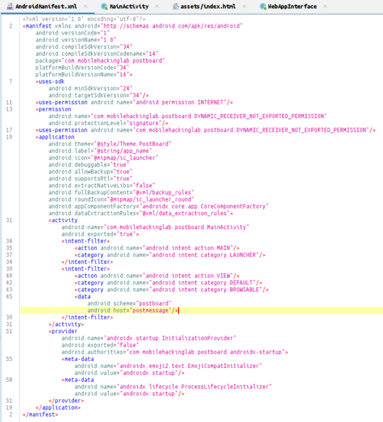
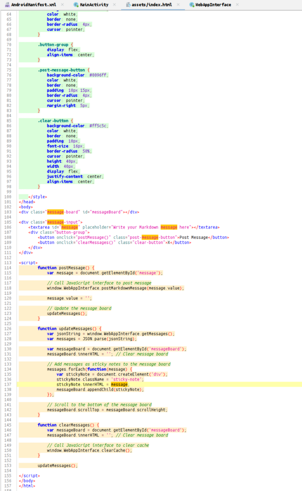
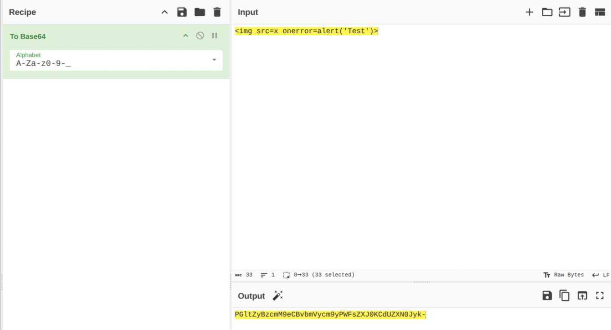
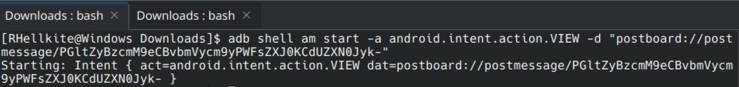
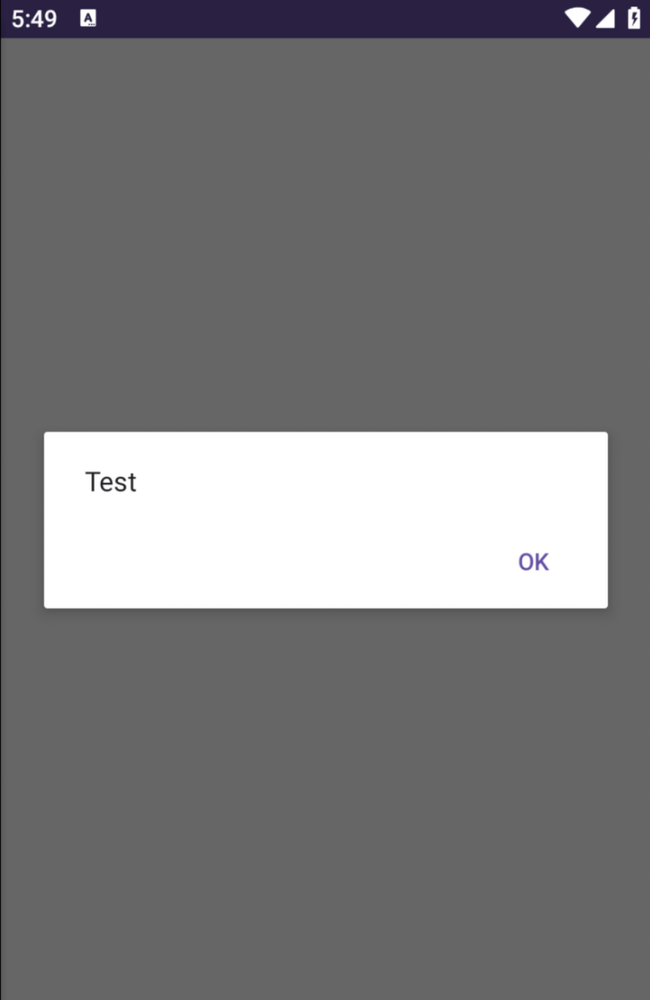
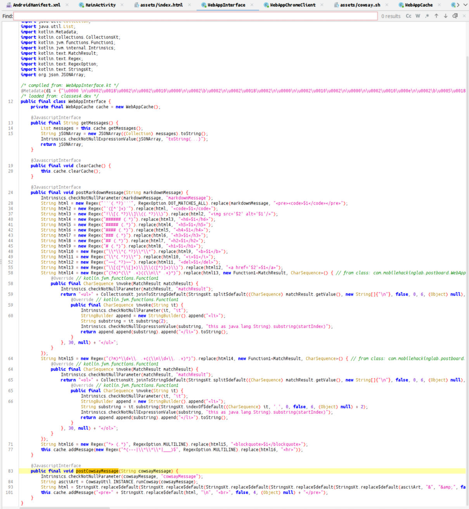
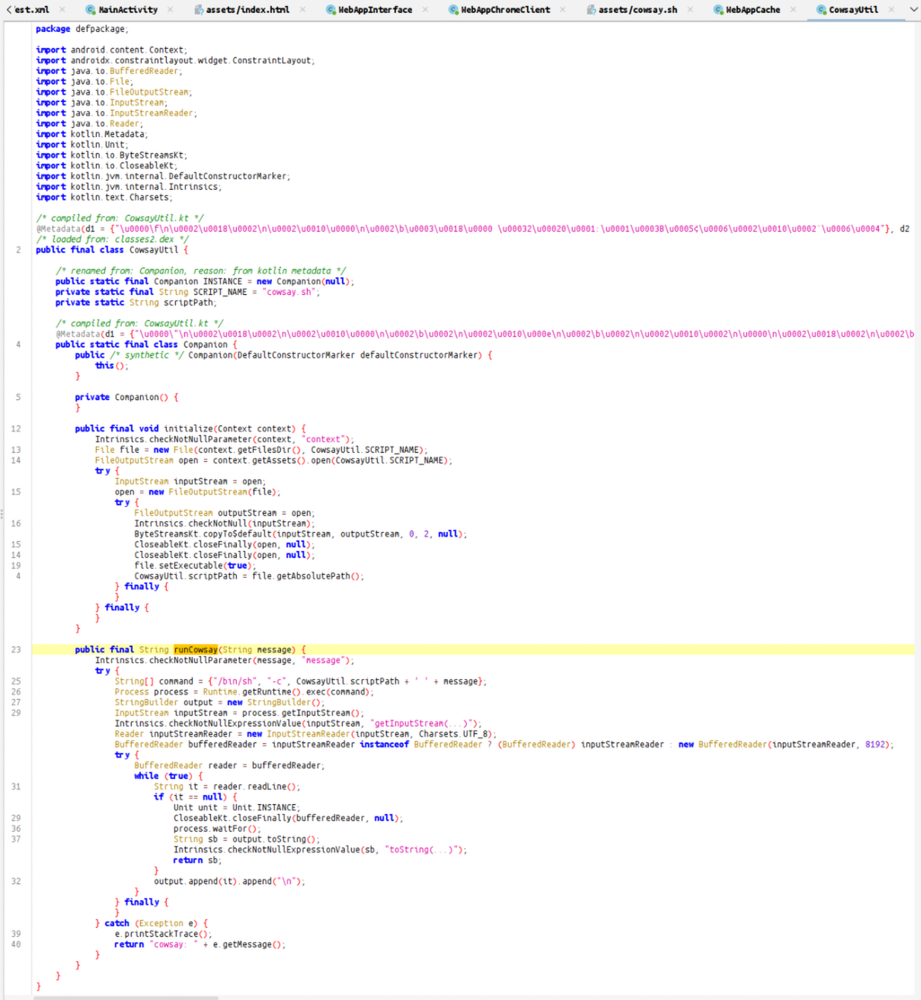
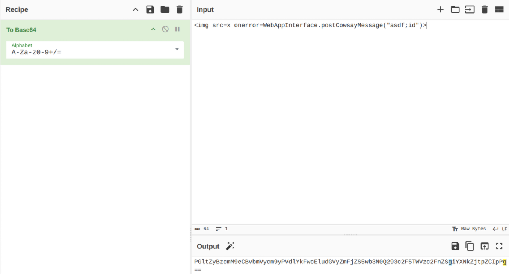
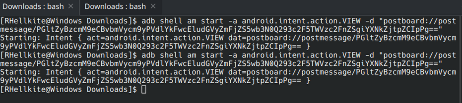
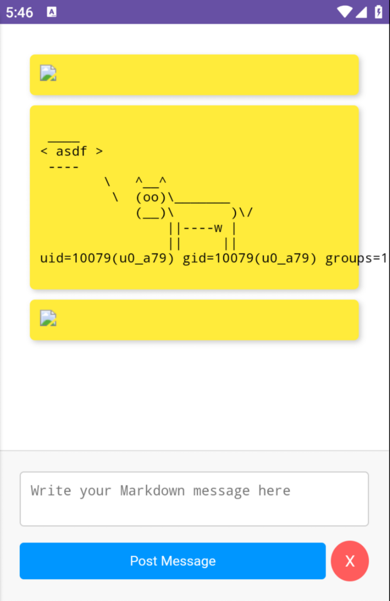

In the manifest, we find an intent-filter with a specified scheme and host.

While analyzing index.html, we notice a pieWe encode the payload.ce of code using innerHTML, which is vulnerable to XSS.

We encode the payload.

Send it using an intent.

And indeed, the HTML tags were parsed.

Further analysis reveals four functions exported to JavaScript, one of which invokes the runCowsay function.

The runCowsay function executes the cowsay.sh script, but due to string concatenation, it is vulnerable to command injection.

We encode the payload calling the vulnerable function in Base64.

Trigger the intent with the encoded payload.

And observe the result of a successful attack.
